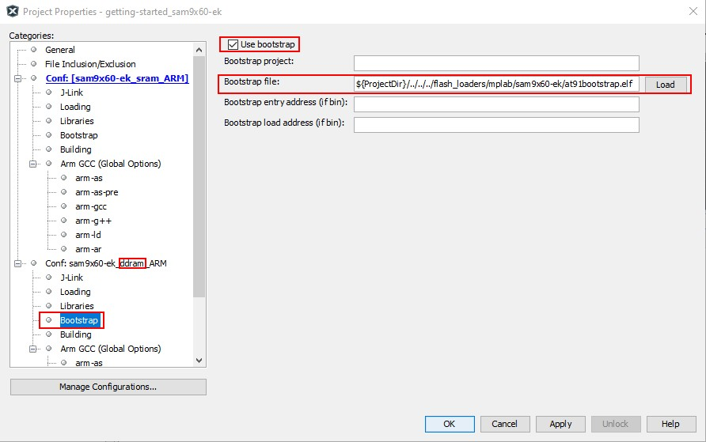

# MPLAB X IDE - Bootstrap

## Overview

Bootstrap is used to initialize a board before MPLAB X IDE download the code of a project to
the target, it is needed when running examples out of "ddram".

For softpack examples, [at91bootstrap](https://github.com/linux4sam/at91bootstrap) acts as the Bootstrap in MPLAB X IDE projects.

## Directory Architecture

### flash_loaders/mplab

- README.md    -    This file itself
- [BOARD_NAME] -    Folders which contain files for the Bootstrap (.elf)

## Boards support

| Board            | Flash | Bootstrap build with                | Bootstrap File
| ---------------- | ----- | ----------------------------------- | -----------------------------------
| sam9x60-ek       | ddram | sam9x60ek_bkptnone_defconfig        | sam9x60-ek/at91bootstrap.elf
| sama5d2-xplained | ddram | sama5d2_xplained_bkptnone_defconfig | sama5d2-xplained/at91bootstrap.elf
| sama5d2-ptc-ek   | ddram | sama5d2_ptc_ek_bkptnone_defconfig   | sama5d2-ptc-ek/at91bootstrap.elf
| sama5d27-som1-ek | ddram | sama5d27_som1_bkptnone_defconfig    | sama5d27-som1-ek/at91bootstrap.elf

## DDRAM support

| Board            | Type  | Device         | bus width(bits)
------------------ | ----- | -------------- | ---------------
| sam9x60-ek       | ddram | W972GG6KB_16   | 16
| sama5d2-xplained | ddram | MT41K128M16    | 16
| sama5d2-ptc-ek   | ddram | W972GG6KB      | 32
| sama5d27-som1-ek | ddram | W971GG6SB      | 16

  Note: For other boards or DDRAMs the corresponding at91bootstrap.elf are need to be used, otherwise the DDRAM can't be initialized properly.

## Build at91bootstrap

### Get source code from github

at91bootstrap source code at: `https://github.com/linux4sam/at91bootstrap`

Get it with git command:
``git clone https://github.com/linux4sam/at91bootstrap.git``

### Clean the directories

Clean the directories with the make command to get a clean workspace:
``make mrproper``

#### Configure before build

Configure [at91bootstrap](https://github.com/linux4sam/at91bootstrap) for a board's Bootstrap with `make xxx_defconfig` (xxx_defconfig are in folder configs/).

Filename with 'bkptnone_defconfig' suffix are used for building Bootstraps.

For example, build the Bootstrap for sam9x60-ek board, run:
``make sam9x60ek_bkptnone_defconfig``

#### Build

Build [at91bootstrap](https://github.com/linux4sam/at91bootstrap) and the outputs are generated in folder build/binaries/:
``make CROSS_COMPILE=arm-none-eabi-``

Notice:
  It's OK to build [at91bootstrap](https://github.com/linux4sam/at91bootstrap) with other compilers, please refer to the documents in [at91bootstrap](https://github.com/linux4sam/at91bootstrap) for detail.

## Setting up Bootstrap(s) in MPLAB X IDE

To use a Bootstrap for downloading your application:

1. Choose **Project -> Properties**.
2. Choose **Bootstrap** in the **Conf:** tree for the DDRAM configuration.
3. Select **Use bootstrap** option.
4. Click button **Load** and select the Bootstrap to be used or type the path of Bootstrap into the box of **Bootstrap file:**.
5. Click **Apply** to save the changes or click **OK** to close the dialog.

### Example of Bootstrap Configuration

Configure `at91bootstrap` as the `Bootstrap` for sam9x60-ek MPLAB X IDE projects:

